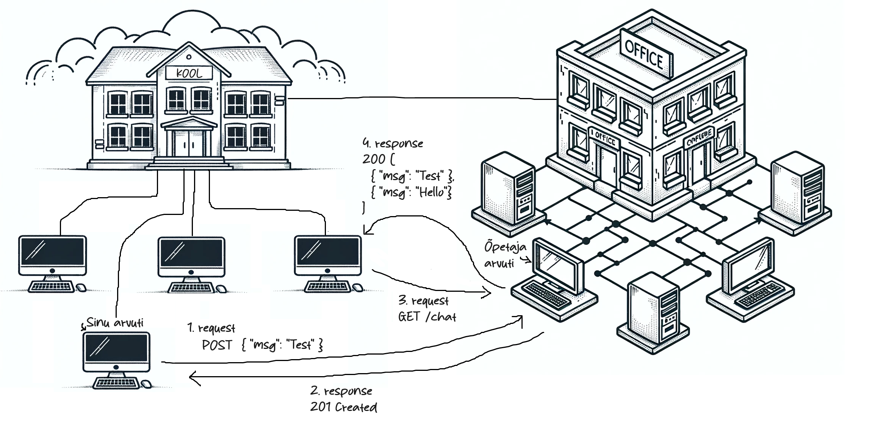

# Sõnumirakendus (olemasoleva serveriga)

Teeme chati programmi kasutades HTML ja JavaScripti.

### 1. Sõnumite koostamine
Mõtleme milliseid osasid üks sõnumirakendus vajab, et sina saaks sõnumit saata.  
Programmeermine need osad HTMLi ja JavaScriptiga. Testime, kas meie sõnum tuleb ekraanile.
### 2. Sõnumite saatmine
Nüüd, kui sinu saadetavad sõnumid juba ekraanile ilmuvad, oleks vaja sõnumeid jagada ka teistega. Me peame saatma sõnumi üle Interneti teisse arvutisse.
Selleks on teie jaoks tehtud valmis programm ning see programm on kävitatud ühes arvutis, mis asub koolimajast väljas.
Me saame sellele arvutile ligi üle Interneti kasutades aadressi `https://kool.krister.ee/chat/ta-23a` (sinu rühma kood lõpus)

Veebilehitsejast saame sõnumi üle Interneti saata kasutades JavaScripti HTTP tööriistu. Otsi koodinäidet netist näidet märksõnadega "javascript browser send json http post request"

#### Mis need märksõnad "javascript browser send json http post request" tähendavad:
- HTTP on protokoll millega saab stringi kujul andmeid Interneti kaudu saata.
- `POST` on HTTP meetod, neid on veel mõned ja nende eesmärk on täpsustada, mis toimingut me teha tahame. Näiteks POST tähendab "saada välja uut informatsiooni"
- `JSON` on tekstiformaat, mis saab hoida endas andmestruktuure nagu objektid ja array'd. Kuna üle Interneti saab saata ainult string tüüpi andmeid, siis JSON aitab meil teha objekti tekstiks.
- `Request` on HTTP üks osa, see tähendab, et me tahame andmed või küsimuse **välja saata**. Selle vastand on `Request`, mis on **vastus** varem välja saadetud andmetele või küsimusele.
  Mõned näited, kuidas mis on `Request` ja `Response`:  
  `Request` on küsimus - `Response` on vastus küsimusele.  
  Meie browser saadab küsimuse - server vastab küsimusele.  
  Meie palume serveril sõnumi teistele edasi saata - server vastab meile, et kas õnnestus või tekkis viga.
  Meie palume serveril meile teiste sõnumid anda - server vastab meile sõnumitega mis talle varem saadetud on.
- Browser pidime otsingusse panema, sest JavaScriptist on mitu versiooni, meie ei kasuta praegu Node versiooni vaid browseri ehk veebilehitseja versiooni (Chrome, Firefox, Safari)

Siin on näide mida meie soovitame kasutada [Stack overflow]()

### 3. Sõnumite vastu võtmine
